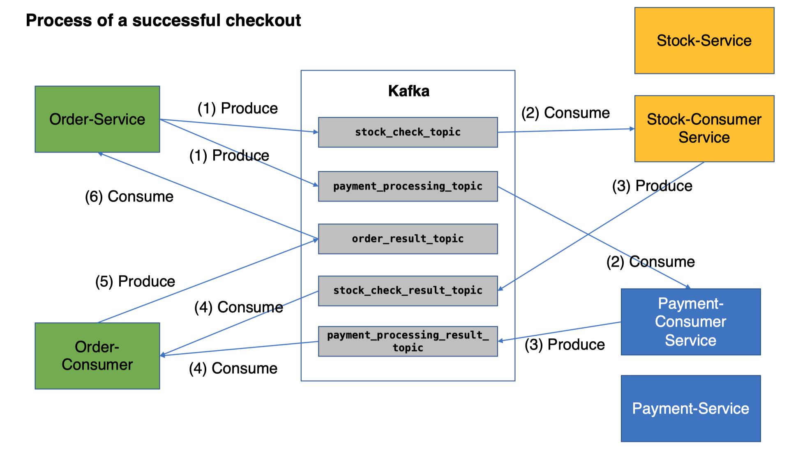

## Architecture: Microservices (Payment + Stock + Order)

The link to detailed project report which highlights our implementation and mutlpile design strategies.

https://docs.google.com/document/d/1TQZDls_SEHRFrA7zrQZcXmHQbkmZ66GAa7szJcpooDY/edit#

Click here to see our [declaration of honour](declaration.md).

This report presents the design and implementation of a distributed e-commerce system using a microservices 
architecture in `Flask` and `Redis`. The procedure involves several components, including `order-service`, `payment-service`, 
`stock-service`, and `consumers` of different services to handle various events. `Kafka` is used as a 
distributed event streaming platform for the intercommunication of these services, and `Redis` is used for data 
storage and retrieval.

Below is the Kafka architecture of our project:

## 1. Test Instructions of Kubernetes Stress Test

#### (1) Start minikube cluster
`minikube start --cpus 7`

#### (2) Start the addon to enable ingress
`minikube addons enable ingress`

#### (3) Deploy the redis
`bash deploy-charts-minikube.sh`

#### (4) Apply files of k8s deployment
`kubectl apply -f k8s/.`

`kubectl apply -f stress-test-k8s/kubernetes-config.`

#### (5) Create a network tunnel to expose services
`minikube tunnel`

#### (6) Access http://127.0.0.1:8089 for the locust test.

## 2. Test Instructions of Consistency Test

Run script `run_consistency_test.py`

### Current Issues

1) Saga pattern is only implemented during checkout.
2) Consistency is not guaranteed in practice.
3) Fault tolerance is not tested but it should work in our design and implementation by enabling kafka offset.

### Future Works

1) Implement partition assigning in kafka.
2) Implement kafka transactions for all endpoints.
3) Add timestamps to Redis for deciding execution orders.
